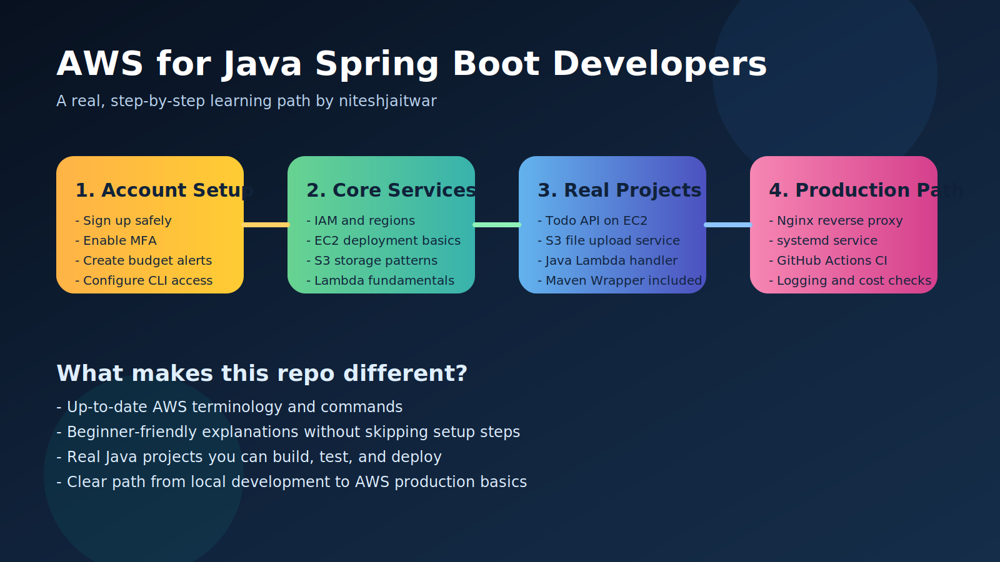
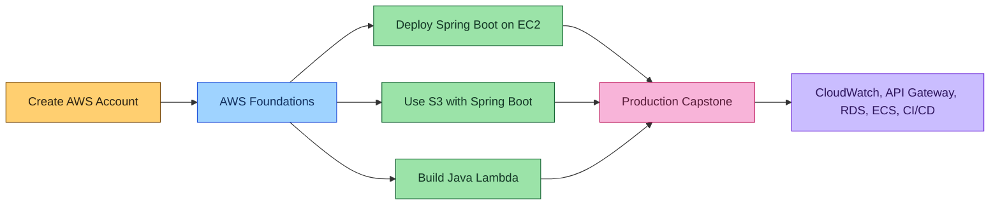

# AWS for Java Spring Boot Developers




Step-by-step AWS learning repository for Java and Spring Boot developers who want to start from zero, understand the main AWS services, and deploy real applications without relying on outdated guides.

This repository is written for readers who want:

- easy-to-follow steps
- no skipped setup details
- real runnable Java examples
- current AWS console names and current CLI commands
- practical scenarios that feel like real work
- interview-focused explanations and questions

The setup flow and AWS guidance in this repository were refreshed against official documentation on `July 4, 2026`.

## Live project site

Visit the live public website here:

- https://niteshjaitwar.github.io/aws-for-java-spring-boot-developers/

This repository also includes the GitHub Pages source in [site/index.html](site/index.html) and the deployment workflow in [.github/workflows/deploy-pages.yml](.github/workflows/deploy-pages.yml).

If you want to see the source repository:

- https://github.com/niteshjaitwar/aws-for-java-spring-boot-developers

## Author

Created and maintained by `niteshjaitwar`.

## Why this repo exists

Many AWS tutorials are either:

- too shallow for real deployment
- too advanced for beginners
- outdated in UI, IAM advice, or commands

This repository is designed to fix that gap for Java and Spring Boot developers.

## What you will learn

| Module | What you learn | Outcome |
| --- | --- | --- |
| `00` | AWS account setup, MFA, budgets, access | Safe AWS starting point |
| `01` | IAM, regions, pricing, AWS mindset | Strong basics |
| `02` | Deploy Spring Boot on EC2 | Real server deployment |
| `03` | Upload and fetch files from S3 | Real storage integration |
| `04` | Build a Java Lambda | Real serverless example |
| `05` | Next services to learn | Clear growth path |
| `06` | Production capstone project | End-to-end architecture |
| `07` | Route 53 + ACM + HTTPS | Custom domain and TLS |
| `08` | Infrastructure as code | Terraform starter path |
| `09` | Free tier and cost control | Learn with lower risk |
| `10` | Troubleshooting guide | Fix common beginner issues |

## Included in this repo

- a runnable Spring Boot Todo API for `EC2`
- a runnable Spring Boot file upload service for `S3`
- a runnable Java `Lambda` sample
- a real `GitHub Actions` CI workflow
- deployable `systemd` and `Nginx` config for EC2
- visual diagrams and step-by-step module docs
- practical scenarios and hands-on exercises in every module
- interview preparation prompts across the learning path

## Best place to start

If you are completely new:

1. [docs/00-aws-account-setup/README.md](docs/00-aws-account-setup/README.md)
2. [docs/01-foundations/README.md](docs/01-foundations/README.md)
3. [docs/02-ec2-spring-boot-deployment/README.md](docs/02-ec2-spring-boot-deployment/README.md)

If you already know AWS basics:

1. [examples/ec2/todo-api/README.md](examples/ec2/todo-api/README.md)
2. [examples/s3/file-upload-service/README.md](examples/s3/file-upload-service/README.md)
3. [examples/lambda/hello-lambda/README.md](examples/lambda/hello-lambda/README.md)

If you want the full production path:

1. [docs/06-production-capstone/README.md](docs/06-production-capstone/README.md)

If you are a student and want a safer low-cost path:

1. [docs/00-aws-account-setup/README.md](docs/00-aws-account-setup/README.md)
2. [docs/09-cost-and-free-tier/README.md](docs/09-cost-and-free-tier/README.md)
3. [docs/10-troubleshooting/README.md](docs/10-troubleshooting/README.md)

## Visual learning path



## Repository map

<details>
<summary><strong>Open the collapsible tree view</strong></summary>

```text
aws-for-java-spring-boot-developers/
+-- .github/
|   +-- ISSUE_TEMPLATE/
|   |   +-- bug_report.md
|   |   +-- documentation_improvement.md
|   |   +-- student_question.md
|   +-- pull_request_template.md
|   +-- workflows/
|       +-- java-examples-ci.yml
|       +-- deploy-pages.yml
+-- assets/
|   +-- diagrams/
|       +-- aws-learning-roadmap.svg
|       +-- capstone-architecture.svg
|   +-- social/
|       +-- aws-java-spring-social-preview.svg
|   +-- screenshots/
|       +-- README.md
+-- deploy/
|   +-- ec2/
|       +-- nginx/
|       |   +-- todo-api.conf
|       +-- systemd/
|       |   +-- todo-api.service
|       +-- README.md
+-- docs/
|   +-- 00-aws-account-setup/
|   +-- 01-foundations/
|   +-- 02-ec2-spring-boot-deployment/
|   +-- 03-s3-with-spring-boot/
|   +-- 04-lambda-for-java/
|   +-- 05-next-steps/
|   +-- 06-production-capstone/
|   +-- 07-route53-https-custom-domain/
|   +-- 08-infrastructure-as-code/
|   +-- 09-cost-and-free-tier/
|   +-- 10-troubleshooting/
+-- examples/
|   +-- ec2/todo-api/
|   +-- s3/file-upload-service/
|   +-- lambda/hello-lambda/
+-- infra/
|   +-- terraform/
|       +-- ec2-s3-baseline/
+-- site/
|   +-- assets/
|   |   +-- social-preview.svg
|   +-- index.html
|   +-- styles.css
|   +-- script.js
|   +-- 404.html
+-- README.md
+-- LICENSE
+-- CONTRIBUTING.md
+-- CODE_OF_CONDUCT.md
```

</details>

## Module guide

<details>
<summary><strong>00 - AWS account setup</strong></summary>

Start here: [docs/00-aws-account-setup/README.md](docs/00-aws-account-setup/README.md)

Topics:

- create an AWS account safely
- enable `MFA`
- set budget alerts
- choose `IAM Identity Center` or a simple IAM admin user setup
- configure `aws configure sso`

</details>

<details>
<summary><strong>01 - AWS foundations</strong></summary>

Start here: [docs/01-foundations/README.md](docs/01-foundations/README.md)

Topics:

- regions and availability zones
- IAM basics
- EC2 vs Lambda mindset
- pricing awareness
- shared responsibility model

</details>

<details>
<summary><strong>02 - Deploy Spring Boot on EC2</strong></summary>

Start here: [docs/02-ec2-spring-boot-deployment/README.md](docs/02-ec2-spring-boot-deployment/README.md)

Topics:

- launch `Amazon Linux 2023`
- use `EC2 Instance Connect` or SSH
- install Java 21
- run the Spring Boot JAR
- add `systemd` and `Nginx`

</details>

<details>
<summary><strong>03 - Use S3 with Spring Boot</strong></summary>

Start here: [docs/03-s3-with-spring-boot/README.md](docs/03-s3-with-spring-boot/README.md)

Topics:

- create a private S3 bucket
- connect the AWS SDK for Java 2.x
- upload and list files
- use IAM roles instead of keys
- generate presigned URLs

</details>

<details>
<summary><strong>04 - Build a Java Lambda</strong></summary>

Start here: [docs/04-lambda-for-java/README.md](docs/04-lambda-for-java/README.md)

Topics:

- current Lambda Java runtime options
- handler structure
- packaging and deploy commands
- when Lambda is a good fit

</details>

<details>
<summary><strong>05 - Next services to learn</strong></summary>

Continue here: [docs/05-next-steps/README.md](docs/05-next-steps/README.md)

Topics:

- `API Gateway`
- `RDS`
- `CloudWatch`
- `ECS`
- `CI/CD`

</details>

<details>
<summary><strong>06 - Production capstone</strong></summary>

Capstone guide: [docs/06-production-capstone/README.md](docs/06-production-capstone/README.md)

Topics:

- GitHub Actions CI
- EC2 + Nginx + Spring Boot
- S3 integration
- Lambda background task
- CloudWatch logs

</details>

<details>
<summary><strong>07 - Route 53 + ACM + HTTPS</strong></summary>

Start here: [docs/07-route53-https-custom-domain/README.md](docs/07-route53-https-custom-domain/README.md)

Topics:

- Route 53 hosted zones
- ACM certificate request
- DNS validation
- Application Load Balancer
- HTTPS for the EC2 deployment

</details>

<details>
<summary><strong>08 - Infrastructure as code</strong></summary>

Start here: [docs/08-infrastructure-as-code/README.md](docs/08-infrastructure-as-code/README.md)

Topics:

- why IaC matters
- Terraform starter structure
- mapping console steps to code
- safe next step after manual AWS learning

</details>

<details>
<summary><strong>09 - Free tier and cost control</strong></summary>

Start here: [docs/09-cost-and-free-tier/README.md](docs/09-cost-and-free-tier/README.md)

Topics:

- current AWS Free Tier model
- what changed for accounts created after `July 15, 2025`
- billing alarms and budget habits
- free AWS learning resources for students and beginners
- how to practice while reducing surprise charges

</details>

<details>
<summary><strong>10 - Troubleshooting guide</strong></summary>

Start here: [docs/10-troubleshooting/README.md](docs/10-troubleshooting/README.md)

Topics:

- EC2 app not loading
- S3 access denied
- Lambda deploy or runtime issues
- HTTPS and DNS mistakes
- CI and billing troubleshooting

</details>

## Real examples

| Example | Purpose | Link |
| --- | --- | --- |
| Todo API | learn EC2 deployment with a real Spring Boot app | [examples/ec2/todo-api/README.md](examples/ec2/todo-api/README.md) |
| File Upload Service | learn S3 integration in Spring Boot | [examples/s3/file-upload-service/README.md](examples/s3/file-upload-service/README.md) |
| Hello Lambda | learn Java Lambda packaging and deploy flow | [examples/lambda/hello-lambda/README.md](examples/lambda/hello-lambda/README.md) |

## Production path assets

| Asset | Use |
| --- | --- |
| [deploy/ec2/systemd/todo-api.service](deploy/ec2/systemd/todo-api.service) | run the app after reboot |
| [deploy/ec2/nginx/todo-api.conf](deploy/ec2/nginx/todo-api.conf) | reverse proxy on EC2 |
| [deploy/ec2/README.md](deploy/ec2/README.md) | deployment asset guide |
| [.github/workflows/java-examples-ci.yml](.github/workflows/java-examples-ci.yml) | current GitHub Actions CI |

## Infrastructure as code starter

Reader-friendly entry points:

- [docs/08-infrastructure-as-code/README.md](docs/08-infrastructure-as-code/README.md)
- [infra/terraform/ec2-s3-baseline/README.md](infra/terraform/ec2-s3-baseline/README.md)

## Student support and contribution flow

If you are learning in public, improving notes, or reporting a broken step, use:

- [.github/ISSUE_TEMPLATE/student_question.md](.github/ISSUE_TEMPLATE/student_question.md)
- [.github/ISSUE_TEMPLATE/documentation_improvement.md](.github/ISSUE_TEMPLATE/documentation_improvement.md)
- [.github/ISSUE_TEMPLATE/bug_report.md](.github/ISSUE_TEMPLATE/bug_report.md)
- [.github/pull_request_template.md](.github/pull_request_template.md)

## Screenshots and visuals

This repository now includes:

- colorful local diagrams that render directly on GitHub
- a public landing page for GitHub Pages
- a social preview banner asset for sharing
- a screenshot capture guide for safe, current AWS console images

Useful links:

- [assets/diagrams/aws-learning-roadmap.svg](assets/diagrams/aws-learning-roadmap.svg)
- [assets/diagrams/capstone-architecture.svg](assets/diagrams/capstone-architecture.svg)
- [assets/social/aws-java-spring-social-preview.svg](assets/social/aws-java-spring-social-preview.svg)
- [assets/screenshots/README.md](assets/screenshots/README.md)
- [site/index.html](site/index.html)

## Important notes for readers

- never commit AWS keys or secrets
- always enable billing alerts
- prefer `aws configure sso` for local CLI access
- prefer IAM roles on EC2 instead of hardcoded keys
- review the current free tier rules before starting labs
- clean up AWS resources after practice

## Official references

- AWS account setup: https://docs.aws.amazon.com/IAM/latest/UserGuide/getting-started-account-iam.html
- Root user best practices: https://docs.aws.amazon.com/IAM/latest/UserGuide/root-user-best-practices.html
- AWS CLI SSO: https://docs.aws.amazon.com/cli/latest/userguide/cli-configure-sso.html
- AWS Free Tier overview: https://docs.aws.amazon.com/awsaccountbilling/latest/aboutv2/free-tier.html
- AWS Free Tier plans: https://docs.aws.amazon.com/awsaccountbilling/latest/aboutv2/free-tier-plans.html
- AWS Free Tier eligibility: https://docs.aws.amazon.com/awsaccountbilling/latest/aboutv2/free-tier-eligibility.html
- Track Free Tier usage: https://docs.aws.amazon.com/awsaccountbilling/latest/aboutv2/tracking-free-tier-usage.html
- EC2 getting started: https://docs.aws.amazon.com/AWSEC2/latest/UserGuide/EC2_GetStarted.html
- EC2 Instance Connect: https://docs.aws.amazon.com/AWSEC2/latest/UserGuide/ec2-instance-connect-methods.html
- EC2 Free Tier usage: https://docs.aws.amazon.com/AWSEC2/latest/UserGuide/ec2-free-tier-usage.html
- EC2 pricing: https://aws.amazon.com/ec2/pricing/on-demand/
- S3 bucket creation: https://docs.aws.amazon.com/AmazonS3/latest/userguide/create-bucket-overview.html
- S3 pricing: https://aws.amazon.com/s3/pricing/
- Lambda Java guide: https://docs.aws.amazon.com/lambda/latest/dg/lambda-java.html
- Lambda pricing: https://aws.amazon.com/lambda/pricing/
- AWS Training and Certification: https://aws.amazon.com/training/
- AWS Skill Builder: https://skillbuilder.aws/
- AWS Academy: https://aws.amazon.com/training/awsacademy/
- AWS Training Events: https://aws.amazon.com/training/events/
- AWS Skills Centers: https://aws.amazon.com/training/skills-centers/
- GitHub Java + Maven workflow: https://docs.github.com/actions/guides/building-and-testing-java-with-maven
- actions/checkout releases: https://github.com/actions/checkout/releases
- actions/setup-java: https://github.com/actions/setup-java

## Repository description

Use this GitHub repository description:

> Step-by-step AWS learning path for Java Spring Boot developers, from account setup to EC2, S3, Lambda, Route 53, HTTPS, and infrastructure-as-code basics.

## License

This project is licensed under the [MIT License](LICENSE).
