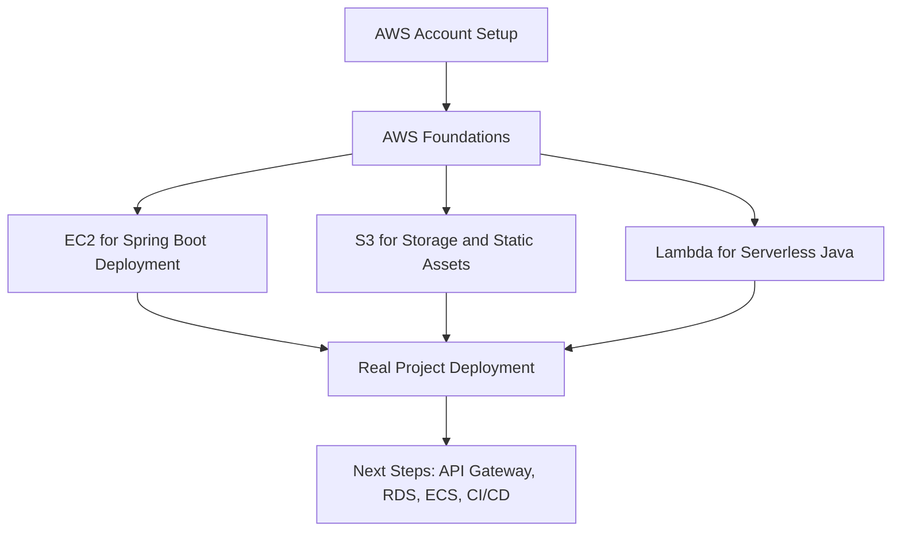

# AWS for Java Spring Boot Developers

Step-by-step AWS learning repository for Java and Spring Boot developers who want to start from zero, understand core AWS services, and deploy real applications on AWS.

This repository is designed for beginners who know Java or Spring Boot but are new to AWS. It starts with creating an AWS account and then moves into practical hands-on work with `EC2`, `S3`, and `Lambda`.

## Who this repo is for

- Java developers starting AWS from scratch
- Spring Boot developers who want to deploy applications on AWS
- Beginners looking for a practical, structured learning path
- Developers building portfolio-ready cloud projects

## What you will learn

- How to create and secure an AWS account
- Core AWS concepts: regions, availability zones, IAM, billing, and networking
- How to deploy a Spring Boot application on `EC2`
- How to store and serve files with `S3`
- How to write and run Java-based `Lambda` functions
- How to think about cost, security, and production basics

## Learning path

1. Create and secure your AWS account
2. Learn AWS basics and common terminology
3. Deploy a Spring Boot app on `EC2`
4. Integrate `S3` with a Spring Boot app
5. Build a Java `Lambda` function
6. Continue to API Gateway, RDS, CloudWatch, ECS, and CI/CD

## Repository tree

```text
aws-for-java-spring-boot-developers/
+-- README.md
+-- LICENSE
+-- CODE_OF_CONDUCT.md
+-- CONTRIBUTING.md
+-- .gitignore
+-- docs/
|   +-- 00-aws-account-setup/
|   |   +-- README.md
|   +-- 01-foundations/
|   |   +-- README.md
|   +-- 02-ec2-spring-boot-deployment/
|   |   +-- README.md
|   +-- 03-s3-with-spring-boot/
|   |   +-- README.md
|   +-- 04-lambda-for-java/
|   |   +-- README.md
|   +-- 05-next-steps/
|       +-- README.md
+-- examples/
    +-- ec2/
    |   +-- todo-api/
    |       +-- README.md
    +-- s3/
    |   +-- file-upload-service/
    |       +-- README.md
    +-- lambda/
        +-- hello-lambda/
            +-- README.md
```

## Topic map



## Module guide

### 00. AWS account setup

Start here: [docs/00-aws-account-setup/README.md](docs/00-aws-account-setup/README.md)

Topics:

- Create your AWS account
- Set up MFA
- Understand billing and free tier
- Create an IAM admin user
- Avoid using the root user for daily work

### 01. Foundations

Start here: [docs/01-foundations/README.md](docs/01-foundations/README.md)

Topics:

- Regions and availability zones
- IAM basics
- Virtual machines vs serverless
- AWS pricing mindset
- Shared responsibility model

### 02. EC2 + Spring Boot deployment

Start here: [docs/02-ec2-spring-boot-deployment/README.md](docs/02-ec2-spring-boot-deployment/README.md)

Topics:

- Launch an EC2 instance
- Connect with SSH
- Install Java and Maven
- Build and run a Spring Boot JAR
- Configure security groups
- Run the app behind `systemd` or `nginx`

### 03. S3 + Spring Boot

Start here: [docs/03-s3-with-spring-boot/README.md](docs/03-s3-with-spring-boot/README.md)

Topics:

- Create an S3 bucket
- Upload and download files
- Manage access with IAM
- Use the AWS SDK in Spring Boot
- Store user-uploaded files

### 04. Lambda for Java

Start here: [docs/04-lambda-for-java/README.md](docs/04-lambda-for-java/README.md)

Topics:

- What serverless means
- Java Lambda handler basics
- Packaging and deployment
- Trigger ideas
- When to use Lambda vs EC2

### 05. Next steps

Continue here: [docs/05-next-steps/README.md](docs/05-next-steps/README.md)

Topics:

- API Gateway
- RDS
- CloudWatch
- Elastic Beanstalk
- ECS and containers
- CI/CD with GitHub Actions

## Suggested project journey

If you want one practical end-to-end path:

1. Build a small Spring Boot REST API locally
2. Deploy it on `EC2`
3. Add file upload with `S3`
4. Add a small background task with `Lambda`
5. Add monitoring and logging

## Open source goals

This repository is intended to stay:

- beginner-friendly
- practical
- example-driven
- safe for public learning

## Important notes

- Never commit AWS access keys or secrets.
- Always set a billing budget in your AWS account.
- Clean up resources after practice to avoid unexpected charges.

## Repository description

Use this GitHub repository description:

> Step-by-step AWS learning path for Java Spring Boot developers, from account setup to EC2, S3, and Lambda deployment.

## License

This project is licensed under the [MIT License](LICENSE).
