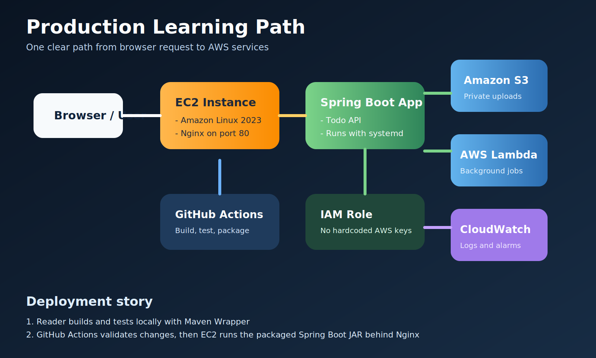

# 06 - Production Capstone Project

This section connects the earlier modules into one realistic learning project.

## Author

Created for this repository by `niteshjaitwar`.

## Goal

Build one portfolio-ready AWS learning project with:

- a Spring Boot API on `EC2`
- `Nginx` in front of the app
- file uploads stored in `S3`
- one Java `Lambda` for a background task
- `CloudWatch` logs for visibility
- `GitHub Actions` for CI

## What you will build

Reader journey:

1. Build and test a Spring Boot API locally
2. Package it with Maven Wrapper
3. Push the code to GitHub
4. Let GitHub Actions run tests and packaging
5. Deploy the JAR to `EC2`
6. Put `Nginx` in front of the app
7. Store uploaded files in `S3`
8. Trigger `Lambda` for async work
9. Review logs in `CloudWatch`

## Architecture



## Before you start

You should finish these first:

- [docs/00-aws-account-setup/README.md](../00-aws-account-setup/README.md)
- [docs/02-ec2-spring-boot-deployment/README.md](../02-ec2-spring-boot-deployment/README.md)
- [docs/03-s3-with-spring-boot/README.md](../03-s3-with-spring-boot/README.md)
- [docs/04-lambda-for-java/README.md](../04-lambda-for-java/README.md)

## Step 1 - Prepare the GitHub repository

Use this repository as the learning source and keep all work in version control.

Important files:

- `.github/workflows/java-examples-ci.yml`
- `examples/ec2/todo-api`
- `examples/s3/file-upload-service`
- `examples/lambda/hello-lambda`

## Step 2 - Run CI on every push

This repository includes a current GitHub Actions workflow:

- [java-examples-ci.yml](../../.github/workflows/java-examples-ci.yml)

What it does:

- checks out the repository
- installs `Temurin 21`
- runs tests
- packages each example

Why it matters:

Readers learn that cloud deployment starts with repeatable builds, not manual guesswork.

## Step 3 - Launch the EC2 instance

Current console flow:

1. Open `EC2`
2. Choose `Launch instance`
3. Set `Amazon Linux 2023`
4. Choose your instance type
5. Review `Network settings`
6. Allow `HTTP` and either `SSH` or `EC2 Instance Connect`
7. Launch the instance

## Step 4 - Install runtime packages

On the instance:

```bash
sudo dnf update -y
sudo dnf install java-21-amazon-corretto-devel nginx git -y
java -version
nginx -v
```

## Step 5 - Copy the Spring Boot app

Build locally:

```bash
cd examples/ec2/todo-api
./mvnw clean package
```

Copy the JAR to EC2:

```bash
scp -i /path/to/key.pem target/todo-api-0.0.1-SNAPSHOT.jar ec2-user@PUBLIC_IP:/home/ec2-user/todo-api-0.0.1-SNAPSHOT.jar
```

## Step 6 - Configure systemd

Copy [deploy/ec2/systemd/todo-api.service](../../deploy/ec2/systemd/todo-api.service) to:

```text
/etc/systemd/system/todo-api.service
```

Then run:

```bash
sudo mkdir -p /home/ec2-user/todo-api
sudo mv /home/ec2-user/todo-api-0.0.1-SNAPSHOT.jar /home/ec2-user/todo-api/todo-api-0.0.1-SNAPSHOT.jar
sudo systemctl daemon-reload
sudo systemctl enable todo-api
sudo systemctl start todo-api
sudo systemctl status todo-api
```

## Step 7 - Configure Nginx

Copy [deploy/ec2/nginx/todo-api.conf](../../deploy/ec2/nginx/todo-api.conf) to:

```text
/etc/nginx/conf.d/todo-api.conf
```

Then test and restart:

```bash
sudo nginx -t
sudo systemctl enable nginx
sudo systemctl restart nginx
```

Why Nginx is useful:

- listens on standard web ports
- forwards traffic to Spring Boot on `8080`
- gives you a clean place to add TLS later

## Step 8 - Attach an IAM role to EC2

Do this before connecting the app to `S3`.

Create an instance role with only the permissions you need, for example:

- `s3:PutObject`
- `s3:GetObject`
- `s3:ListBucket`

Avoid access keys on the server. The AWS SDK can read instance credentials automatically.

## Step 9 - Connect the S3 upload service

The S3 example already expects:

- `AWS_REGION`
- `APP_S3_BUCKET_NAME`

On the EC2 instance, define environment variables in the `systemd` service or a separate environment file.

## Step 10 - Add Lambda

Use the Lambda example as a background worker.

Good beginner use cases:

- process uploaded files
- generate thumbnails
- send a webhook
- write an audit event

Current CLI deploy flow:

```bash
cd examples/lambda/hello-lambda
./mvnw clean package
aws lambda create-function \
  --function-name hello-lambda \
  --runtime java21 \
  --role arn:aws:iam::<account-id>:role/lambda-basic-execution-role \
  --handler com.example.aws.lambda.HelloLambdaHandler \
  --zip-file fileb://target/hello-lambda.jar
```

## Step 11 - Verify the deployment

Check these in order:

1. `curl http://PUBLIC_IP/`
2. `curl http://PUBLIC_IP/actuator/health`
3. upload a file to the S3 service
4. invoke the Lambda function
5. read logs in `CloudWatch`

## Step 12 - Read logs and debug safely

EC2 application logs:

```bash
sudo journalctl -u todo-api -f
```

Nginx logs:

```bash
sudo tail -f /var/log/nginx/access.log
sudo tail -f /var/log/nginx/error.log
```

Lambda logs:

- open `CloudWatch`
- choose `Log groups`
- open the log group for your Lambda function

## Common mistakes readers should avoid

- using the root AWS account for daily tasks
- opening all ports to `0.0.0.0/0`
- hardcoding AWS credentials in application files
- skipping `systemd` and losing the process after logout
- uploading files to a public S3 bucket by mistake
- deploying without first running local tests

## What good looks like at the end

By the end of this capstone, the reader should have:

- one public endpoint served by Nginx
- one healthy Spring Boot API on EC2
- one working S3 upload path
- one working Lambda deployment
- one CI workflow in GitHub Actions
- a much clearer mental model of how AWS services work together

## Official references

- GitHub Java + Maven workflow: https://docs.github.com/actions/guides/building-and-testing-java-with-maven
- actions/checkout releases: https://github.com/actions/checkout/releases
- actions/setup-java: https://github.com/actions/setup-java
- EC2 getting started: https://docs.aws.amazon.com/AWSEC2/latest/UserGuide/EC2_GetStarted.html
- Lambda Java guide: https://docs.aws.amazon.com/lambda/latest/dg/lambda-java.html
