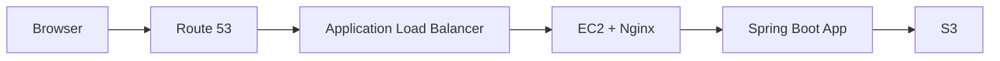

# 07 - Route 53, ACM, and HTTPS for Your Spring Boot App

This chapter shows the clean AWS-native way to serve your Spring Boot application with a custom domain and HTTPS.

## Author

Created for this repository by `niteshjaitwar`.

## The important AWS concept

`AWS Certificate Manager (ACM)` certificates are not installed directly on a plain EC2 instance in the same way you would install a certificate on Nginx manually.

For an AWS-native HTTPS setup, use:

```text
Route 53 -> ACM certificate -> Application Load Balancer -> EC2 -> Spring Boot app
```

## Why this path is better for beginners

- HTTPS is handled by the load balancer
- certificate renewal is easier with ACM
- you keep your EC2 application simpler
- this is closer to a real production pattern

## Architecture



## What you need first

- one registered domain name
- one hosted zone in Route 53, or DNS control at another registrar
- one running EC2 instance
- one working HTTP deployment before adding HTTPS

## Step 1 - Register or bring a domain

If you need a new domain, the current Route 53 console path is:

1. Open `Route 53`
2. Choose `Registered domains`
3. Choose `Register domains`

If you already have a domain from another registrar, that is also fine.

Official reference:

- Route 53 domain registration: https://docs.aws.amazon.com/Route53/latest/DeveloperGuide/domain-register.html

## Step 2 - Create or confirm the hosted zone

Current Route 53 console flow:

1. Open `Route 53`
2. Choose `Hosted zones`
3. Choose `Create hosted zone`
4. Enter your domain name
5. Keep the zone type as `Public hosted zone`

If your domain is registered outside AWS, update the registrar name servers to the Route 53 hosted zone values.

## Step 3 - Request a public ACM certificate

Current ACM console flow:

1. Open `AWS Certificate Manager`
2. Choose `Request`
3. Choose `Request a public certificate`
4. Enter your domain names

Recommended names:

- `example.com`
- `www.example.com`

Prefer `DNS validation`.

Why:

- AWS recommends DNS validation
- it is easier to renew automatically
- it avoids email validation delays

Official references:

- Request public certificate: https://docs.aws.amazon.com/acm/latest/userguide/gs-acm-request-public.html
- DNS validation: https://docs.aws.amazon.com/acm/latest/userguide/dns-validation.html

## Step 4 - Create DNS validation records

After requesting the certificate:

1. Open the certificate details
2. Find the validation section
3. If the domain is in Route 53, choose the button that creates records automatically when available
4. Otherwise create the shown `CNAME` records in your DNS provider

Important current ACM behavior:

- if validation is not completed, the certificate will stay pending
- certificate requests can time out after `72 hours`

Official reference:

- Troubleshoot certificate requests: https://docs.aws.amazon.com/acm/latest/userguide/troubleshooting-cert-requests.html

## Step 5 - Create an Application Load Balancer

Current EC2 console path:

1. Open `EC2`
2. In the left menu choose `Load Balancers`
3. Choose `Create load balancer`
4. Choose `Application Load Balancer`

Recommended settings:

- scheme: `Internet-facing`
- IP address type: `IPv4`
- at least two subnets in different availability zones
- security group allowing `HTTP 80` and `HTTPS 443`

## Step 6 - Create a target group

The target group points traffic from the ALB to your EC2 instance.

Recommended target group settings:

- target type: `Instances`
- protocol: `HTTP`
- port: `80` if Nginx is on port `80`
- health check path: `/actuator/health`

Register your EC2 instance in the target group.

## Step 7 - Add listeners

Recommended listener setup:

- listener `80` redirects to `443`
- listener `443` forwards to the target group

When creating the `HTTPS 443` listener:

- choose the ACM certificate you requested

Official reference:

- ALB certificate docs: https://docs.aws.amazon.com/elasticloadbalancing/latest/application/https-listener-certificates.html

## Step 8 - Create Route 53 alias records

Now connect the domain to the load balancer.

Current Route 53 flow:

1. Open the hosted zone
2. Choose `Create record`
3. For the root domain, create an `A` record
4. Turn on `Alias`
5. Choose `Alias to Application and Classic Load Balancer`
6. Select your load balancer

Do the same for `www` if needed.

Official reference:

- Route traffic to an ELB load balancer: https://docs.aws.amazon.com/Route53/latest/DeveloperGuide/routing-to-elb-load-balancer.html

## Step 9 - Test the domain

Check:

1. `http://yourdomain.com` should redirect to HTTPS
2. `https://yourdomain.com` should open successfully
3. certificate should be trusted by the browser
4. `/actuator/health` should return healthy status

## Common mistakes

- trying to attach ACM directly to EC2 without a supported AWS service in front
- forgetting DNS validation records
- using the wrong hosted zone
- creating the ALB in subnets that are not public
- forgetting to allow ALB traffic to the EC2 security group
- pointing Route 53 directly to the EC2 public IP instead of the ALB

## Best practice for this repository

For the cleanest learning path:

1. first deploy on plain HTTP using the EC2 chapter
2. then add custom domain and HTTPS using this chapter

That way readers learn each layer one by one.

## Official references

- Route 53 domain registration: https://docs.aws.amazon.com/Route53/latest/DeveloperGuide/domain-register.html
- ACM setup: https://docs.aws.amazon.com/acm/latest/userguide/setup.html
- ACM public certificates: https://docs.aws.amazon.com/acm/latest/userguide/gs-acm-request-public.html
- ACM DNS validation: https://docs.aws.amazon.com/acm/latest/userguide/dns-validation.html
- Route 53 alias to ELB: https://docs.aws.amazon.com/Route53/latest/DeveloperGuide/routing-to-elb-load-balancer.html
- ALB HTTPS certificates: https://docs.aws.amazon.com/elasticloadbalancing/latest/application/https-listener-certificates.html

